# Restrudel

### Turn mp3 snippets into Strudel code.

> 🚧 **Beta** — Restrudel is released as **v0.9.0-beta**: the full pipeline
> works end-to-end, and rough edges are expected. Debug tooling lives in the
> app under *Developer (beta)*.

Upload a track, select a few seconds, and get back an editable, playable
[Strudel](https://strudel.cc) live-coding pattern — remix it right in the browser.

## How it works

<picture>
  <source media="(prefers-color-scheme: dark)" srcset="docs/assets/pipeline_dark.svg">
  
</picture>

The transcription model is the heart of the pipeline: an automatic music
transcription transformer **fine-tuned on synthesizer timbres** — the one thing
stock models have never heard, and the reason they fail on electronic music.

## Architecture

<picture>
  <source media="(prefers-color-scheme: dark)" srcset="docs/assets/architecture_dark.svg">
  
</picture>

The song is uploaded once; every new snippet selection is just a time range.
The GPU bills per second only while a request runs and scales to zero when
idle. Checkpoints are versioned on the network volume, so a better model
deploys by uploading a directory — no code changes.

## Does the fine-tuning work?

The base model transcribes acoustic instruments well — and collapses on
synthesizers. Fine-tuning on synthetic Strudel renders, real chiptune, and
timbre-coverage augmentation fixes exactly that:

<picture>
  <source media="(prefers-color-scheme: dark)" srcset="docs/assets/benchmark_dark.png">
  
</picture>

The gains hold on **real songs by held-out artists** and on an **external
dataset the model never saw** — and they are reproducible: a second training
seed lands within ±0.02 on every number.

---

Master's project by Henrik Flöter · current release: **v0.9.0-beta** · deep-dive docs:
[roadmap](docs/roadmap.md) ·
[application architecture](docs/application_architecture.md)
