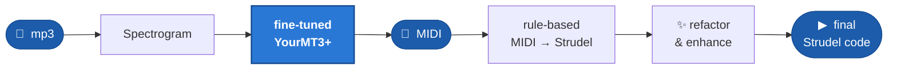
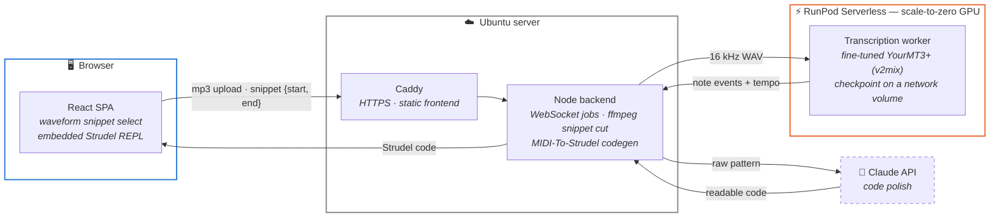
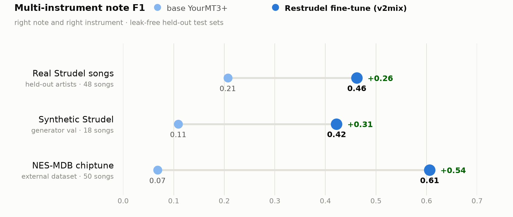

# Restrudel

### Turn mp3 snippets into Strudel code.

Upload a track, select a few seconds, and get back an editable, playable
[Strudel](https://strudel.cc) live-coding pattern — remix it right in the browser.

## How it works

The transcription model is the heart of the pipeline: an automatic music
transcription transformer **fine-tuned on synthesizer timbres** — the one thing
stock models have never heard, and the reason they fail on electronic music.

## Architecture

The song is uploaded once; every new snippet selection is just a time range.
The GPU bills per second only while a request runs and scales to zero when
idle. Checkpoints are versioned on the network volume, so a better model
deploys by uploading a directory — no code changes.

## Does the fine-tuning work?

The base model transcribes acoustic instruments well — and collapses on
synthesizers. Fine-tuning on synthetic Strudel renders, real chiptune, and
timbre-coverage augmentation fixes exactly that:

<picture>
  <source media="(prefers-color-scheme: dark)" srcset="docs/assets/benchmark_dark.png">
  
</picture>

The gains hold on **real songs by held-out artists** and on an **external
dataset the model never saw** — and they are reproducible: a second training
seed lands within ±0.02 on every number.

---

Master's project by Henrik Flöter · deep-dive docs:
[roadmap](docs/roadmap.md) ·
[application architecture](docs/application_architecture.md) ·
[benchmark analysis](docs/benchmark_interpretation_20260713.md)
